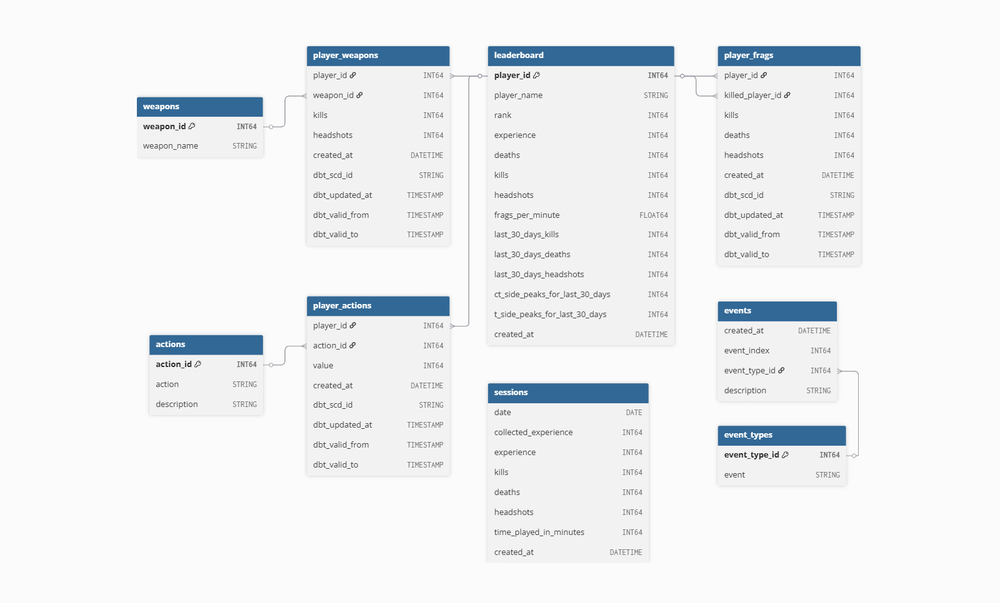
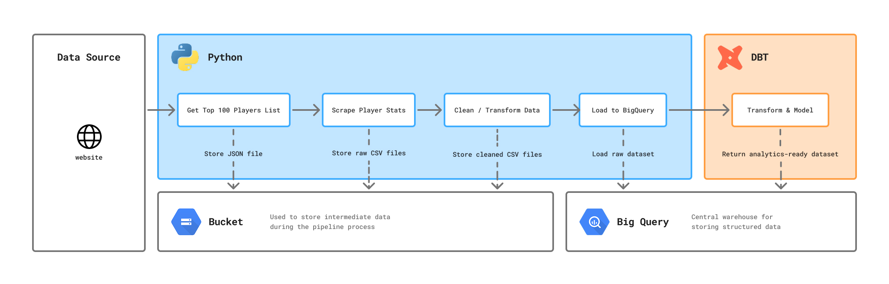
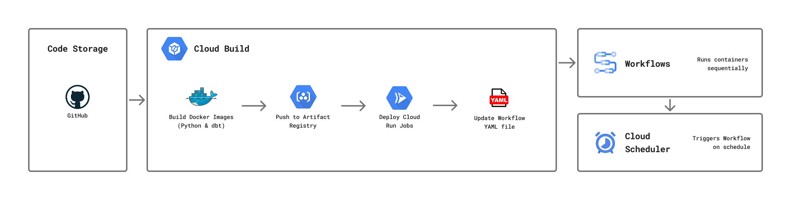

# Project Overview

**Subject:** Player statistics and leaderboard data for an FPS game server.

**Problem:**  
The game server’s website displays only **current player stats** (recent activity and rankings), with no historical data.  
As a result, it’s impossible to track performance over time, identify trends, or compare player progress.

**Solution:** 
1. **Develop a data pipeline** that collects and stores historical data in a warehouse, ensuring long-term access to player performance records.
2. **Deliver insights** through interactive dashboards in Power BI and detailed reports in Excel.

**Used Tools:** `Python`, `SQL`, `dbt`, `BigQuery`, `Google Cloud`, `Excel`, `Power BI`, `Docker`, `Git`

 

# Data Pipeline

As a result, the pipeline automatically collects raw data from the website and stores it as analytics-ready datasets in `BigQuery`. Each run processes around 3–5 MB of data and is scheduled to run weekly.

### Challenges during Development

| Challenge | Description |
|-----------|-------------|
| **Understanding the data source** | Identifying how the website generates player stats, determining which metrics matter, and selecting only the most relevant data using domain knowledge. |
| **Web scraping** | Without an API, data had to be scraped from web pages — an iterative, hard-to-test process that often led to bugs. |
| **Time zone handling** | Converting timestamps correctly across different time zones to ensure accurate data. |
| **Data modeling** | Designing an efficient schema in `dbt` and implementing slowly changing dimensions to preserve historical player data. |

 

## Pipeline Logic

The pipeline is split into **three Docker containers** — one for **web scraping**, one for **data processing and loading to BigQuery**, and one for **dbt transformations** that produce the final analytics tables.

### Python  
- Extracts data from web pages using `requests` and `BeautifulSoup`.  
- Uses `Google Cloud` libraries to read and write data to `Cloud Storage` and `BigQuery`.  
- Cleans and transforms data with `pandas`, handling operations not easily done in SQL.

### dbt  
- Defines reusable logic through `macros`.  
- Manages small, rarely changing datasets with `seeds`.  
- Builds `incremental models` to efficiently append or update data.  
- Uses `snapshots` to capture and preserve historical changes.

 

## Orchestration and Scheduling

For orchestration and scheduling was chosen Google Cloud services over Airflow because:
- **Lower cost** — Serverless tools like `Cloud Run Jobs` and `Workflows` cost far less than Composer or Astronomer.  
- **Easy deployment** — Running Docker containers in the cloud is simpler than managing Airflow setups.  
- **Right fit** — Airflow is more advanced than needed; retries, env variables, and basic logic are easily handled in Google Cloud or Python.  
- **Native integration** — Works seamlessly with `BigQuery`, `Cloud Storage`, and other Google services.  
- **No maintenance** — Fully managed, scalable, and requires zero infrastructure management.

| Tool / Service            | Description                                                                                           | Role in the Project                                                                                 |
|----------------------------|-------------------------------------------------------------------------------------------------------|------------------------------------------------------------------------------------------------------|
| `Git`                      | Version control system for managing source code.                                                     | Stores and tracks code changes for project.                           |
| `Google Cloud Build`       | CI/CD automation service that executes build and deploy steps defined in YAML.                       | Builds Docker containers, deploys Cloud Run jobs, and updates Workflows with environment variables. |
| `Docker`                   | Containerization platform for packaging code and dependencies.                                       | Ensures consistent execution environments for all pipeline steps.                                   |
| `Artifact Registry`        | Secure container image repository.                                                                   | Stores built Docker images for use by Cloud Run Jobs.                                               |
| `Google Cloud Run Jobs`    | Serverless compute service for running containerized batch tasks.                                   | Executes ETL tasks such as data extraction, transformation, and loading.                            |
| `Google Workflows`         | Orchestration service that connects multiple Google Cloud services using YAML instructions.          | Chains Cloud Run Jobs sequentially, managing execution flow and dependencies.                       |
| `Cloud Scheduler`          | Cron-like scheduling service in Google Cloud.                                                        | Triggers the Workflow automatically on a defined schedule.                  |

 

# Analytics

coming soon...