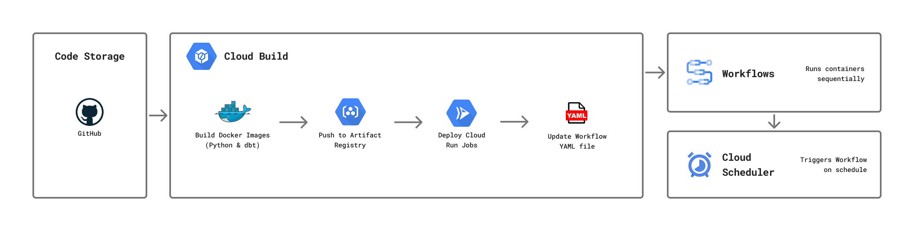
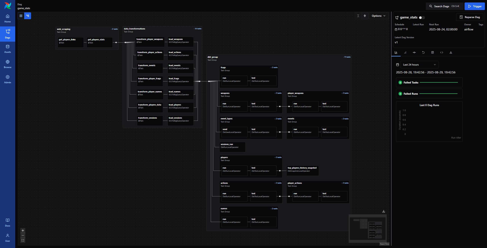

# Project Overview

**Objective:** Build a data pipeline that scrapes player statistics from a website and delivers analytics-ready tables for reporting and insights.

**Data Source:** Player stats and rankings from a Counter-Strike: Source server leaderboard.

**Used Tools:** `Python`, `SQL`, `dbt`, `Airflow`, `Git`, `Docker`, `Google Cloud Storage`, `BigQuery`, `Google Cloud Services`.

### Result:

A regularly updated dataset in BigQuery, organized into fact and dimension tables. The pipeline orchestration is implemented in two alternative approaches, each available in its own branch:  
- [**gcp_pipeline**](https://github.com/gnoevoy/game_stats/tree/gcp-pipeline) → Containerized pipeline orchestrated with **Google Cloud services**.  
- [**airflow**](https://github.com/gnoevoy/game_stats/tree/airflow) → Pipeline orchestrated with **Apache Airflow**, deployed using Astronomer.

 

## Pipeline Logic

### Python:
- Used `requests` and `BeautifulSoup4` for scraping player stats
- Applied `pandas` for cleaning and transforming raw data 
- Implemented structured logging with Python's `logging` module
- Added `try-except` blocks for robust error handling
- Organized scripts modularly across multiple files

### dbt:
- Defined `models` to transform raw data into analytics-ready tables
- Configured `sources` for reliable data inputs
- Built `incremental models` for efficient updates
- Created `snapshots` to track historical changes
- Loaded static reference data with `seeds`
- Used reusable `macros` to keep SQL logic modular
- Added `tests` to ensure data quality
- Configured multiple `profiles` for different environments

 

## Google Cloud Orchestration

| Service / Tool       | Use Case                                                                 |
|----------------------|----------------------------------------------------------------------------------------|
| **GitHub**           | Stores pipeline code and deployment configuration files  |
| **Docker**           | Packages code into containers to deploy in cloud environments |
| **Cloud Build**      | CI/CD tool that builds and deploys containers, updates `workflow.yaml`. Also stores env variables |
| **Artifact Registry**  | Repository where Docker images are stored before deployment                   |
| **Cloud Run**        | Runs containers serverlessly in the cloud       |
| **Workflows**        | Orchestrates container execution and task sequencing           |
| **Cloud Scheduler**  | Triggers workflows on a schedule (like a CRON job)     |

| File                | Purpose                                                                                     |
|--------------------|---------------------------------------------------------------------------------------------|
| `cloudbuild.yaml`   | Defines the CI/CD logic in Google Cloud Build |
| `workflow.yaml`     | Defines the execution sequence of tasks in Google Cloud Workflows |

This architecture automates a data pipeline using Google Cloud services. Code is versioned in GitHub, containerized with Docker, and deployed via Cloud Build to Cloud Run. Pipeline steps and CI/CD logic are defined in `workflow.yaml` and `cloudbuild.yaml`, while Workflow and Scheduler ensure tasks run in order and on schedule.

[**Go to gcp_pipeline branch**](https://github.com/gnoevoy/game_stats/tree/gcp-pipeline)

 

## Airflow

### Features:
- Configured the DAG to run on a weekly schedule using `@weekly` option
- Used groups with the `@task_group` decorator to separate logic
- Credentials and variables managed through Astronomer UI and `.env` locally
- Used Google Cloud `hooks` and `operators` for reading/writing GCS data and loading to BigQuery
- Integrated `dbt` via `Cosmos` module to visualize the project and run models in the DAG

The pipeline is built and tested locally using the `Astro CLI`, then deployed to the cloud with **Astronomer**. This approach allows quick iteration on DAGs during development, while Astronomer handles production deployment, monitoring, and environment management through a simple UI.  

[**Go to airflow branch**](https://github.com/gnoevoy/game_stats/tree/airflow)