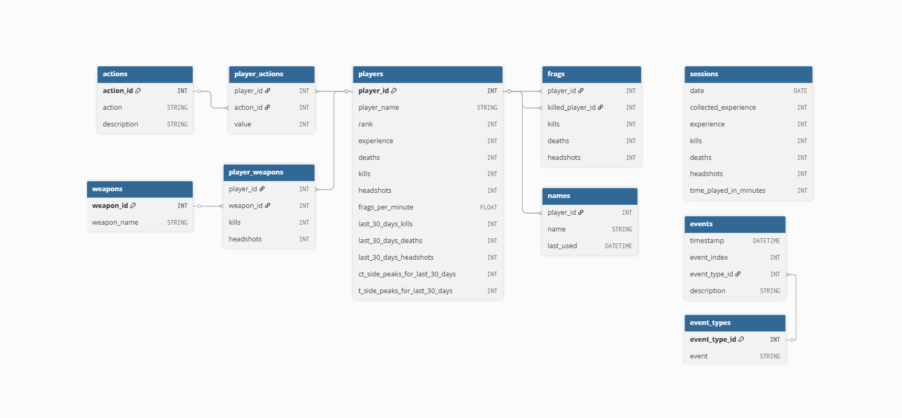

# Project Overview

**Objective:** Build a data pipeline that scrapes stats from a website and delivers a clean, analytics-ready dataset. The script is automated and scheduled to run in the Google Cloud.

**Data Source:** Player stats and rankings from a Counter-Strike: Source server leaderboard.

**Used Tools:** `Python`, `SQL`, `dbt`, `Git`, `Docker`, `Google Cloud Storage`, `BigQuery`, `Google Cloud`

**Result:** Regularly updated snowflake-style dataset in BigQuery, organized into fact and dimension tables.

 

## Pipeline Logic

### Python:
- Applied `requests` + `BeautifulSoup4` modules for scraping player stats 
- Used `pandas` to clean and transform raw data into structured format  
- Set up structured logging using Python's built-in `logging` module  
- Implemented `try-except` logic for error handling throughout the code 
- Scripts are modular and organized across files

### DBT:
- Configured multiple `profiles` to support both local development and cloud execution  
- Built `incremental models` to efficiently update only new or changed records  
- Defined reusable `macros` to keep SQL logic modular and reusable 
- Loaded static reference data using `seeds`  
- Implemented `snapshots` to track historical changes in a table  
- Added basic `tests` to ensure data quality and catch issues early  

 

## Cloud Automation & Orchestration

| Service / Tool       | Use Case                                                                 |
|----------------------|----------------------------------------------------------------------------------------|
| **GitHub**           | Stores pipeline code and deployment configs (YAML files). |
| **Docker**           | Packages code into containers. Ensures consistency across environments. |
| **Cloud Build**      | CI/CD tool that builds and deploys containers automatically. Also updates workflow yaml file.             |
| **Artifact Registry**| Secure repository where Docker images are stored before deployment.                   |
| **Cloud Run**        | Runs containers serverlessly with environment variables and volume support.        |
| **Workflows**        | Orchestrates the flow of containers to ensure tasks run in proper sequence.           |
| **Cloud Scheduler**  | Triggers workflows based on a schedule (like a CRON job). Enables automated runs.     |

This architecture automates a data pipeline using Google Cloud services. Code is versioned in GitHub, containerized with Docker, and deployed via Cloud Build into a serverless environment (Cloud Run). Workflow and Scheduler ensure tasks are orchestrated and executed on a schedule.